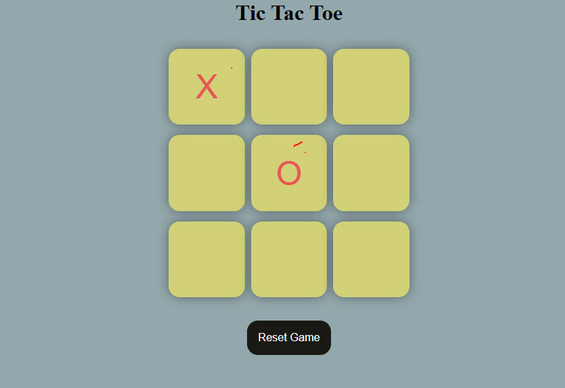

# Tic Tac Toe

A simple Tic Tac Toe game built with HTML, CSS, and JavaScript for two players.

## Features
- Interactive 3x3 grid
- Two-player mode
- Highlights enabled boxes for the next move
- Detects win, draw, and ongoing game states

## Getting Started

### Prerequisites
- A modern web browser

### Installation
1. Download or clone this repository.
2. Navigate to the project directory:
   ```
   cd "c:\Users\asd\Documents\projects for Mern and Js\Tic Tac Toe"
   ```

### Running the Game
- Open `index.html` in your web browser.

## How to Play
- Players take turns clicking on empty boxes to place their mark (X or O).
- The first player to align three marks horizontally, vertically, or diagonally wins.
- If all boxes are filled without a winner, the game ends in a draw.

## Customization
- You can modify the styles in the CSS file to change the appearance of the board and highlights.

## License
This project is for educational purposes.
